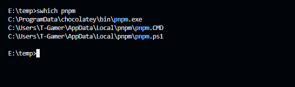
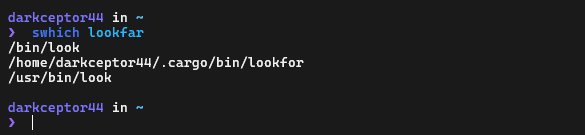

# superwhich

`superwhich` is a cross-platform CLI tool that was initially meant to be a faster drop-in replacement for Windows' `where` command but since it uses [Jaro-Winkler distance](https://en.wikipedia.org/wiki/Jaro%E2%80%93Winkler_distance) to calculate the similarity between the strings it can be called a sort of "smart" which, it can handle some typos and highlights the section of the executables that matches the search pattern.

## Installation

- From [crates.io](https://crates.io/crates/superwhich): `cargo install superwhich`
- From [GitHub](https://github.com/DarkCeptor44/superwhich): `cargo install --git https://github.com/DarkCeptor44/superwhich`
- Manually (after cloning the repo locally): `cargo install --path .`
- From [releases](https://github.com/DarkCeptor44/superwhich/releases/latest).

## Usage




```sh
$ swhich -h
Cross-platform smart which alternative

Usage: swhich [OPTIONS] <PATTERN>

Arguments:
  <PATTERN>  The search pattern

Options:
  -c, --color <COLOR>  Color of the highlighted text (off for no color) [default: blue]
  -t, --print-time     Print time elapsed
  -h, --help           Print help
  -V, --version        Print version
```

## Todo

- Make it faster (currently at `~270ms` on Windows).
- Find a better way to match the pattern to the name when printing the result.

## Benchmarks

The benchmarks were run using [Hyperfine](https://github.com/sharkdp/hyperfine).

### Machine A

- AMD64, 32GB RAM, Ryzen 7 3800X, Windows 10.

| Command | Mean [ms] | Min [ms] | Max [ms] | Relative |
|:---|---:|---:|---:|---:|
| `swhich pnpm` | 274.3 ± 4.0 | 264.7 | 279.0 | 2.55 ± 0.09 |
| `where pnpm` | 107.6 ± 3.7 | 104.2 | 119.9 | 1.00 |

### Machine B

- ARM64, 1GB RAM, Orange Pi Zero2, Debian 12.

| Command | Mean [ms] | Min [ms] | Max [ms] | Relative |
|:---|---:|---:|---:|---:|
| `swhich lookfor` | 17.4 ± 1.2 | 16.2 | 20.3 | 6.41 ± 0.71 |
| `which lookfor` | 2.7 ± 0.2 | 2.3 | 4.5 | 1.00 |

## License

This project is licensed under the terms of the [GNU General Public License](LICENSE) v3.0.
